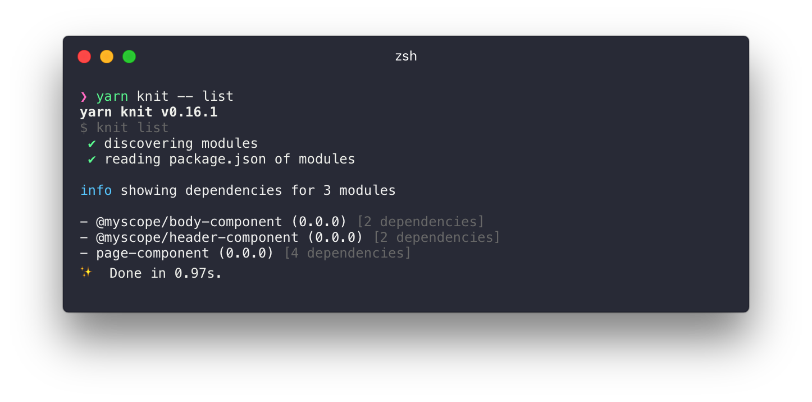
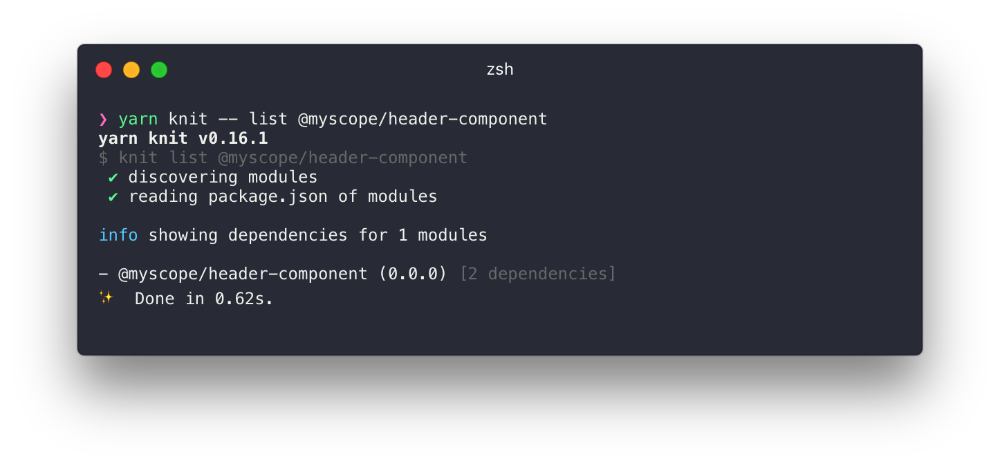
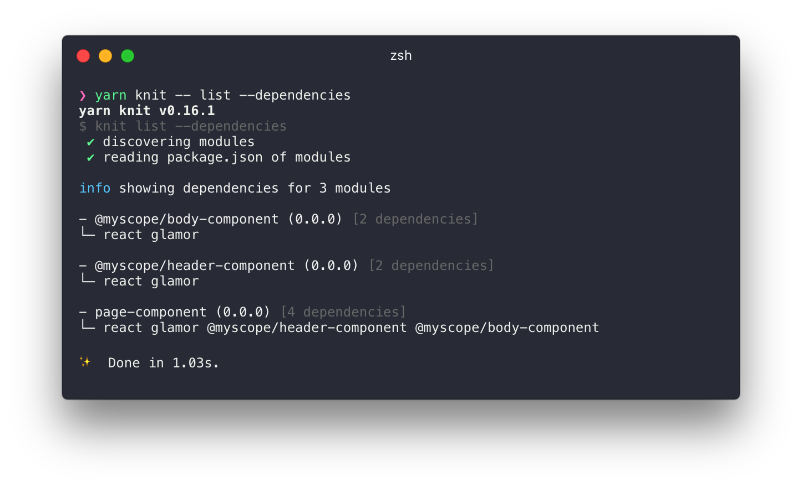

---

## Install

It is recommended that knit be installed as a local package using npm scripts but it can also work as a global package.

#### Global

```
yarn global add @knit/knit
```

#### Local

```
yarn add @knit/knit
```

```
// package.json
{
  ...
  "scripts": {
    ...
    "knit": "knit"
  }
}
```

## Commands

#### list [options] [modules...]

This command will list out your modules with their dependency count and show whether you have missing packages you need to install:

```
yarn knit -- list
```



You can pass in module names to limit the scope of the search:

```
yarn knit -- list @myscope/header-component
```



#### list -d, --dependencies

Passing `--dependencies` will expand the dependencies into a list to show you a more detailed view of your modules:

```
yarn knit -- list --dependencies
```



#### list -u, --updated

This command shows which modules have been updated since the last release. It considers modules that have updated dependencies to be updated themselves. For example if `page-component` depends on `@myscope/body-component` modifying `@myscope/body-component` will return:

```
yarn knit -- list --updated
```


#### validate

This command is used to make sure the project configuration will work with `knit` and looks to make sure their are no missing or unused dependencies.

```
yarn knit -- validate
```


## CLI Addons (We call them Mittens)

The knit cli has addons that are not included by default but will automatically integrate when they are installed:

[Developer Mittens](https://github.com/knitjs/knit/tree/master/modules/node_modules/%40knit/mittens-develop) - Preconfigured development tools for running web servers, tests, linters etc.

[Publisher Mittens](https://github.com/knitjs/knit/tree/master/modules/node_modules/%40knit/mittens-publish) - Preconfigured build tools for releasing and publishing your projects
