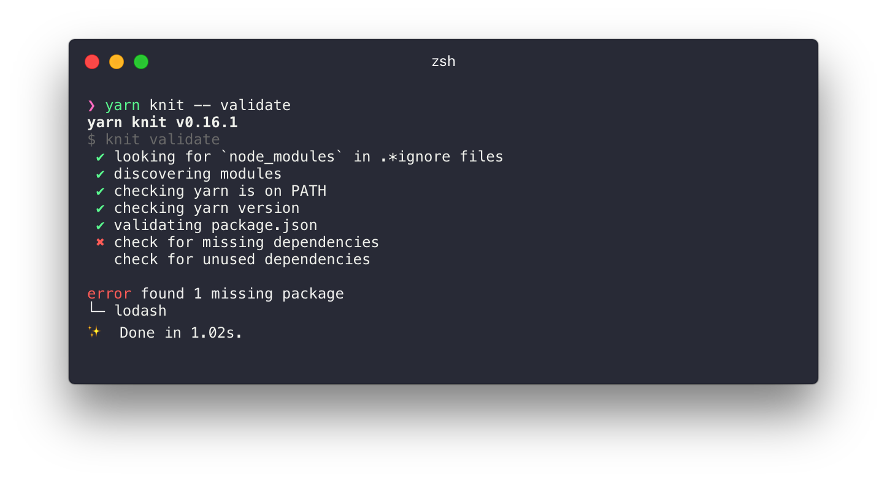
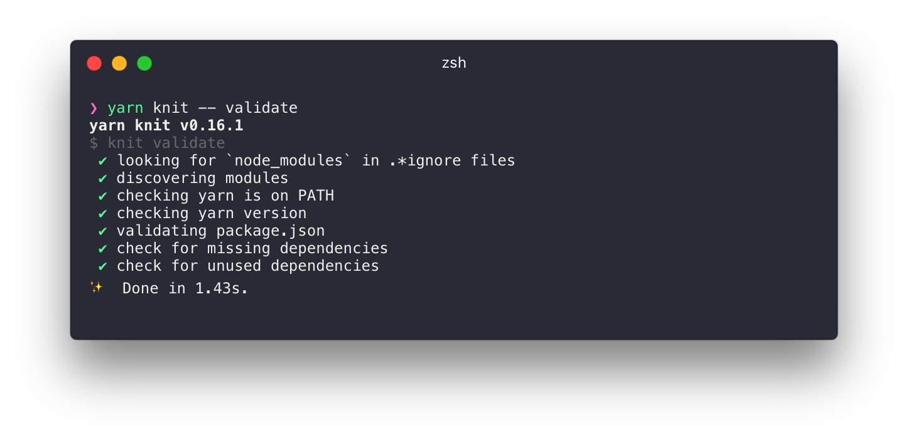
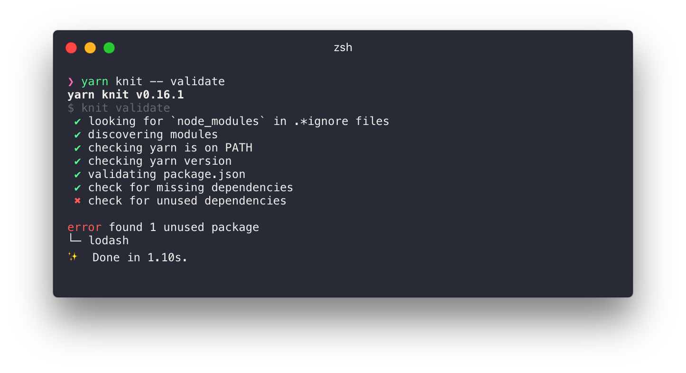

## Install

```
yarn global add create-knit-app
```

## Getting Started

After installing `create-knit-app` use it to create a new project:

```
create-knit-app lets-start-knitting
```

Follow the instruction on screen and spin up a dev server:

```
cd lets-start-knitting
yarn start
```

Open http://localhost:8080 to view your project in the browser.

To see how these components depend on each other run `yarn knit -- list -d` in your terminal:


A dependencies list is built by scanning each module for required packages. This list can then be used to determine if you have missing or unused dependencies.

Lets add a new dependency to `@myscope/page-component` without adding it to your root `package.json`

```
// @myscope/page-component
import 'lodash'
```

Now when we run `yarn knit -- list -d` it will show the missing dependency:


You can also check for missing dependencies by running `yarn knit -- validate`.

Learn more about `validate` [here]().



We can fix this by installing `lodash` with Yarn:

```
yarn add lodash
```



Now that we have things working lets break them again. Go back into `@myscope/page-component` and remove `import 'lodash'` and then re-run `validate`:



Knit is comparing the comparing the dependencies found in your modules with the `dependencies` saved in your root `package.json` and can warn you if you have missing or unused packages!

## Learn more about KnitJS

You can learn more about what you can do with knit by visiting our [github repo](https://github.com/knitjs/knit) or by running `yarn knit -- --help`


