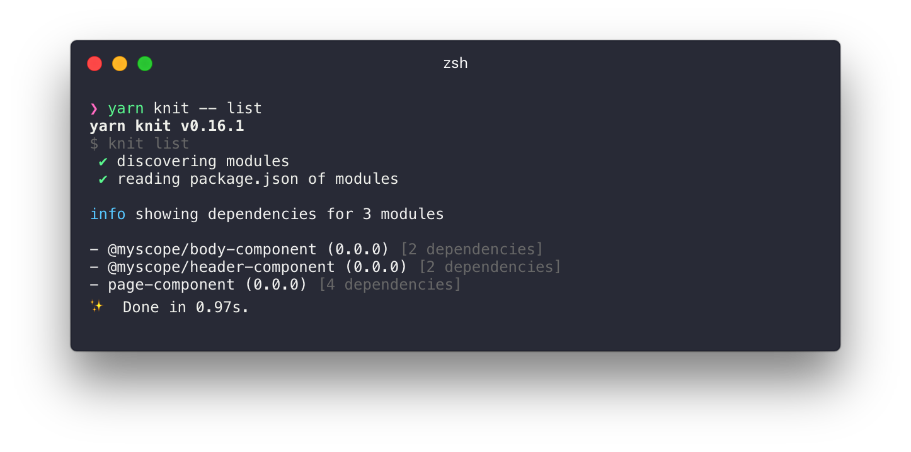
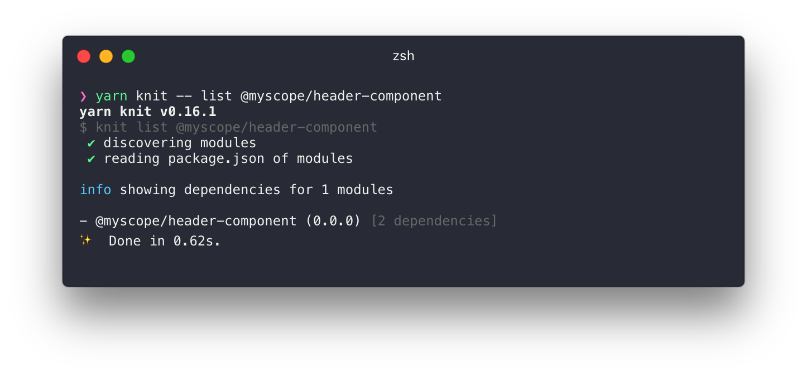
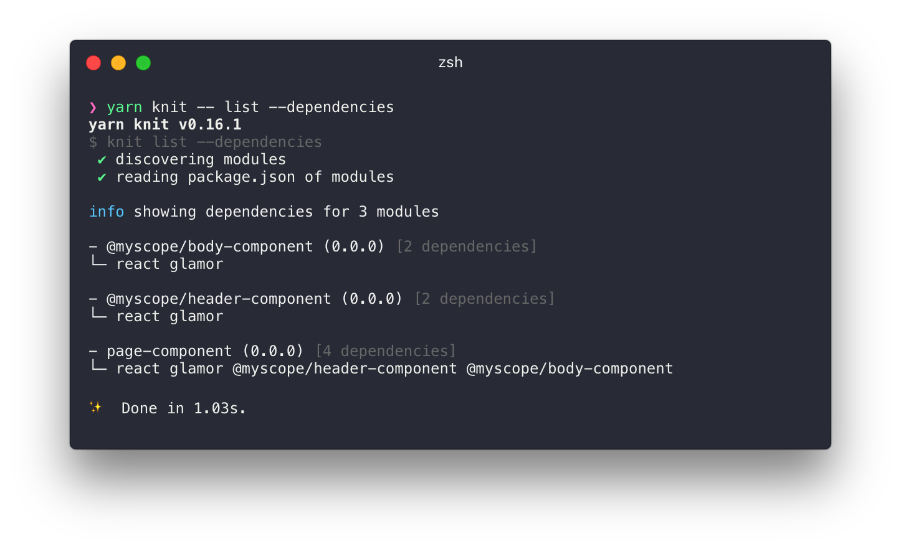
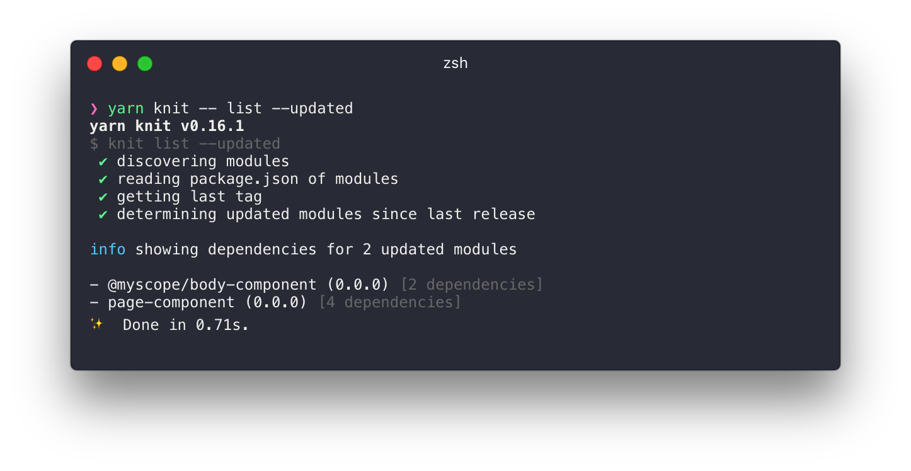
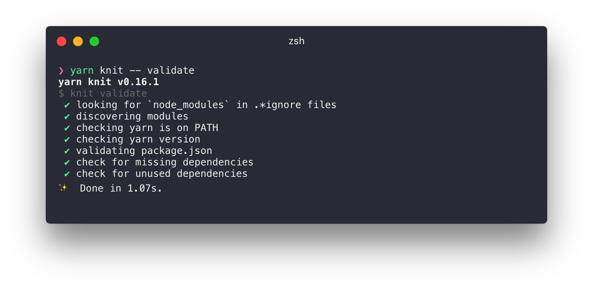

---

## Install

It is recommended that knit be installed as a local package using npm scripts but it can also work as a global package.

#### Global

```
yarn global add @knit/knit
```

#### Local

```
yarn add @knit/knit
```

```
// package.json
{
  ...
  "scripts": {
    ...
    "knit": "knit"
  }
}
```

## Commands

#### list [options] [modules...]

This command will list out your modules with their dependency count and show whether you have missing packages you need to install:

```
yarn knit -- list
```



You can pass in module names to limit the scope of the search:

```
yarn knit -- list @myscope/header-component
```



#### list -d, --dependencies

Passing `--dependencies` will expand the dependencies into a list to show you a more detailed view of your modules:

```
yarn knit -- list --dependencies
```



#### list -u, --updated

This command shows which modules have been updated since the last release. It considers modules that have updated dependencies to be updated themselves. For example if `page-component` depends on `@myscope/body-component` modifying `@myscope/body-component` will return:

```
yarn knit -- list --updated
```



#### validate

This command is used to make sure the project configuration will work with `knit` and looks to make sure their are no missing or unused dependencies.

```
yarn knit -- validate
```



#### server

```
❯ yarn knit -- server
Usage: server [options]

start a dev server

Options:

  -h, --help           output usage information
  -p, --port <port>    set server port
  -h, --host <host>    set server host
  -r, --proxy <proxy>  set proxy uri
```

#### relay

```
❯ yarn knit -- relay
Usage: relay [options]

update relay schema

Options:

  -h, --help  output usage information
```

This command will call out to a GraphQL server to fetch its schema and save it locally. Useful for running query validation without a live server (tests, travis etc.)

#### version

```
❯ yarn knit -- version <version>
Usage: version [options] <version>

version updated modules

Options:

  -h, --help       output usage information
  -f, --force-all  version all modules. (will fail if version already released)
```

This will bump the version of all updated modules and tag and commit to git.

#### build

```
❯ yarn knit -- build
Usage: build [options]

build updated modules

Options:

  -h, --help       output usage information
  -f, --force-all  build all modules
```

The updated packages are built against `commonjs`, `es6 modules` and `umd` targets.

#### stitch

```
❯ yarn knit -- stitch
Usage: stitch [options]

stitch updated modules

Options:

  -h, --help       output usage information
  -f, --force-all  knit all modules. (will fail if version already published)
```

The updated dependencies are stitched together - all required dependencies and meta data are added to the module `package.json`s.

#### publish

```
❯ yarn knit -- publish
Usage: publish [options]

publish updated modules

Options:

  -h, --help       output usage information
  -f, --force-all  publish all modules. (will fail if version already published)
```

This command does not commit anything to git and must be done on a tagged commit. All updated modules are publish to the npm registry and can be used by `require`, `import`, modern tree-shaking bundlers like `webpack` and `rollup` using `jsnext:main` and as script tags thanks to https://unpkg.com.

#### release

```
❯ yarn knit -- release  <version>
Usage: knit [options]

release updated modules

Options:

  -h, --help       output usage information
  -f, --force-all  release all modules. (will fail if version already published)
```

This command will run all updated modules through the full release process: `version->build->stitch->publish` and then push to git. If you would like to modify this work flow each step has been broken out into its own command for you to mix and match as needed.
